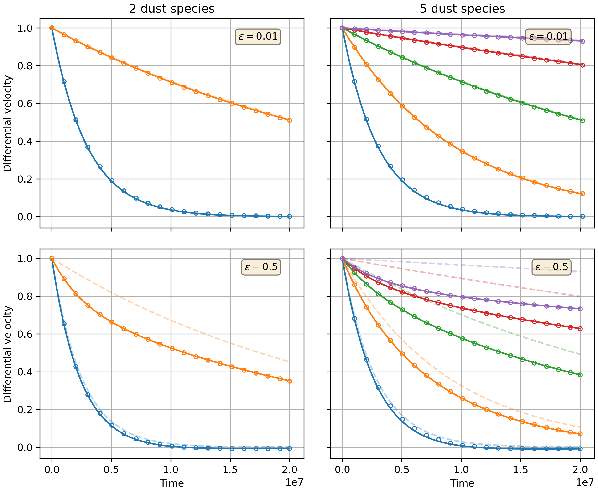
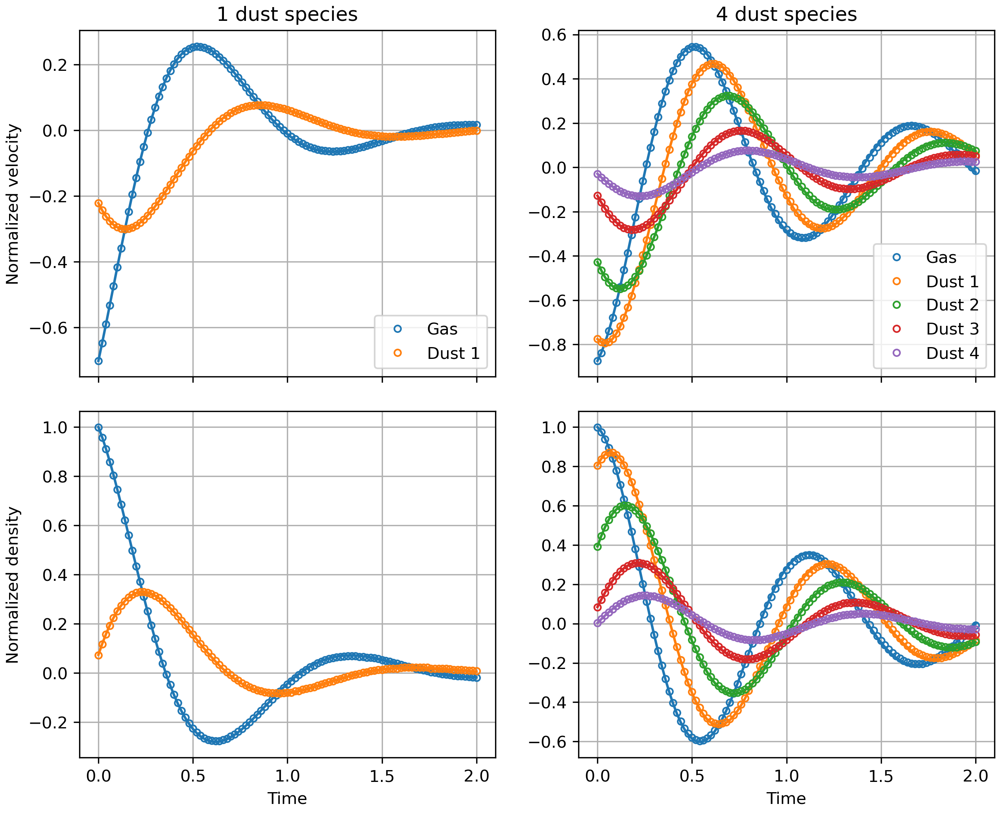
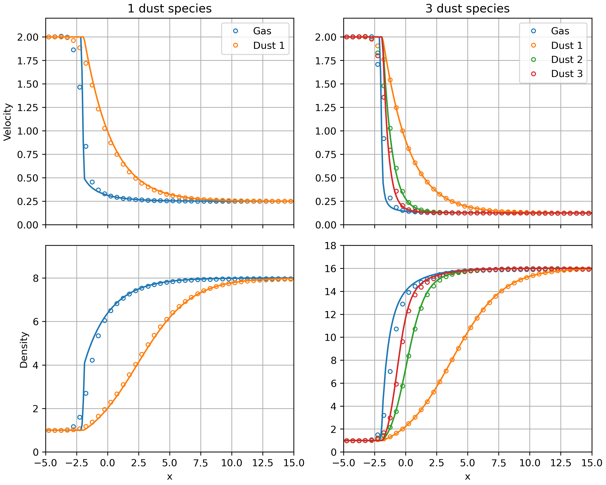
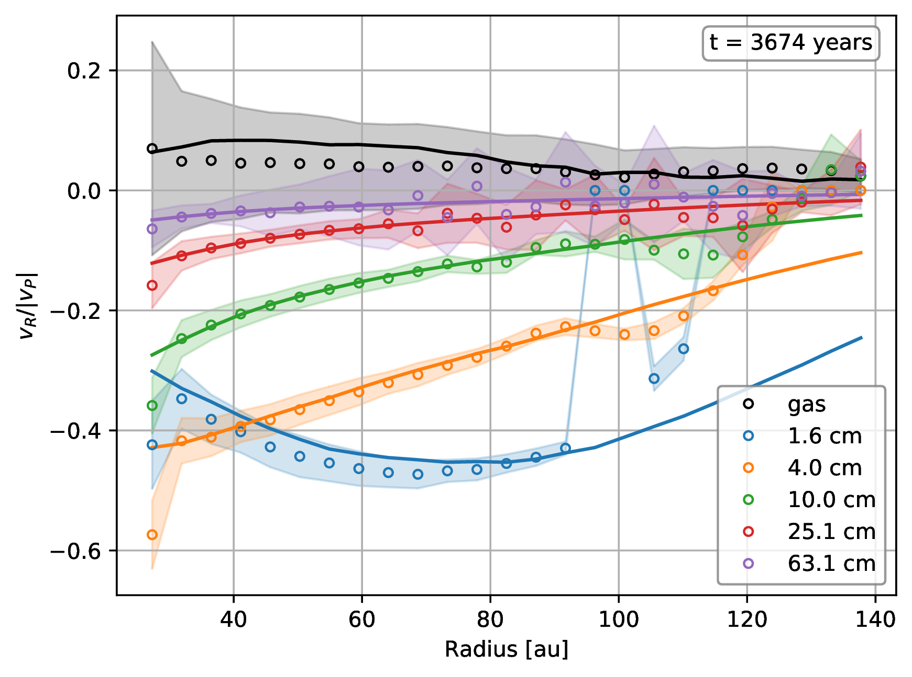

A smoothed particle hydrodynamics algorithm for multigrain dust with separate sets of particles
===

by Daniel Mentiplay, Daniel Price, Christophe Pinte, and Guillaume Laibe

Manuscript accepted for publication in the *Monthly Notices of the Royal Astronomical Society*.

- DOI: [10.1093/mnras/staa3171](http://dx.doi.org/10.1093/mnras/staa3171)
- ADS: [2020MNRAS.499.3806M](https://ui.adsabs.harvard.edu/abs/2020MNRAS.499.3806M/abstract)
- arXiv: [2010.06074](https://arxiv.org/abs/2010.06074)

**This repository contains the data and code used to produce all results and figures shown in the paper.**

An archived version of this repository is available at Figshare at [10.6084/m9.figshare.13076435](https://doi.org/10.6084/m9.figshare.13076435).

Abstract
--------

> We present a method for simulating the dynamics of a mixture of gas and multiple species of large Stokes number dust grains, typical of evolved protoplanetary discs and debris discs. The method improves upon earlier methods, in which only a single grain size could be represented, by capturing the differential backreaction of multiple dust species on the gas. This effect is greater for large dust-to-gas ratios that may be expected in the later stages of the protoplanetary disc life. We benchmark the method against analytic solutions for linear waves, drag and shocks in dust-gas mixtures, and radial drift in a protoplanetary disc showing that the method is robust and accurate.

Software
--------

We implemented the multigrain dust methods in [Phantom](https://github.com/danieljprice/phantom). In fact, this method for multigrain dust has been in the Phantom master branch since [`64dbd2b1`](https://github.com/danieljprice/phantom/commit/64dbd2b124ca74051eed920d6cad0a2e83157478), September 18, 2018. For this manuscript, the focus is testing the method.

### Setting up the environment

All the code added to Phantom is in the code directory, as are Python scripts to run the tests, and to perform analysis on them. The `environment.yml` file with this repository contains the Python required packages. To use this file to create a Conda environment for this work, and then use it, do

```bash
conda env create --file environment.yml
conda activate multigrain
jupyter labextension install @jupyter-widgets/jupyterlab-manager jupyter-matplotlib
jupyter nbextension enable --py widgetsnbextension
```

Note: there is also a conda environment file `environment_exact.yml` with the exact packages used to produce the manuscript.

Results
-------

We use Phantom version [`666da9e8`](https://github.com/danieljprice/phantom/commit/666da9e892cb3f2d9f89e132504e185fe2f22f31) with some patches in the [`code/patches`](https://github.com/dmentipl/multigrain/tree/master/code/patches) directory applied in particular cases. As long as the conda environment (described above) is set up, the scripts to set up and run the tests and analyse the results should do everything. I.e. you don't need to manually clone Phantom and apply patches. Nor do you have to run `phantom` and `phantomsetup` manually. The scripts *should* do this.

### Running the Phantom multigrain tests

There are Python scripts to setup and run the tests located in [`code/scripts`](https://github.com/dmentipl/multigrain/tree/master/code/scripts).

#### Dusty-box

The dusty-box tests are quick (minutes) and can be run on a local machine. The data generated is about 360 MB in size.

- `dustybox_setup_and_run_time_evolution.py` runs 6 tests: 3 with total dust-to-gas ratio of 0.01, and 3 with total dust-to-gas ratio of 0.5. In each triple there is 1 dust species, 2 dust species, and 5 dust species.
- `dustybox_setup_and_run_stability.py` to check the stability criterion.
- `dustybox_setup_and_run_accuracy.py` to check the accuracy of the method.



*Dusty-box with 2 and 5 dust species.*

#### Dusty-wave

The dusty-wave tests are quick (tens of minutes) and can be run on a local machine. The data generated is about 250 MB in size.

- `dustywave_setup_and_run.py` runs 2 tests: one with 1 dust species and one with 4 dust species.



*Dusty-wave with 1 and 4 dust species.*

#### Dusty-shock

The dusty-shock tests are slow (hours to days) and should be run on a cluster. The total data generated is about 290 GB in size.

- `dustyshock_setup_and_schedule.py` runs a slew of tests. This relies on `dustyshock.toml.j2` which is a [phantom-build](https://github.com/dmentipl/phantom-build) config file.

Note: not all runs listed in `dustyshock.toml.j2` are required in order to reproduce the manuscript figures. Those required are:

- `N_1-nx_32-smooth_fac_2.0-hfact_1.0` (for the initial conditions)
- `N_1-nx_128-smooth_fac_2.0-hfact_1.2`
- `N_1-nx_128-smooth_fac_2.0-hfact_1.5`
- `N_1-nx_128-smooth_fac_2.0-hfact_1.8`
- `N_3-nx_128-smooth_fac_2.0-hfact_1.2`
- `N_3-nx_128-smooth_fac_2.0-hfact_1.5`
- `N_3-nx_128-smooth_fac_2.0-hfact_1.8`



*Dusty-shock with 1 and 3 dust species.*

#### Radial drift

The radial drift test is slow (approx. two weeks) and should be run on a cluster. The total data generated is about 20 GB in size.

The Phantom .in and .setup files are in [`code/initial-conditions/radialdrift/test1`](https://github.com/dmentipl/multigrain/tree/master/code/initial-conditions/radialdrift/test1).



*Radial drift test.*

### Performing analysis on the tests

There are notebooks in [`code/notebooks`](https://github.com/dmentipl/multigrain/tree/master/code/notebooks) to perform analysis on the Phantom output.

### Manuscript figures

Python scripts for generating the manuscript figures (after running the tests above) are available in [`code/scripts`](https://github.com/dmentipl/multigrain/tree/master/code/scripts).

- `dustybox_figures.py`
- `dustywave_figures.py`
- `dustyshock_figures.py`
- `radialdrift_figures.py`

Manuscript
----------

Make the manuscript with

```bash
make manuscript
```
